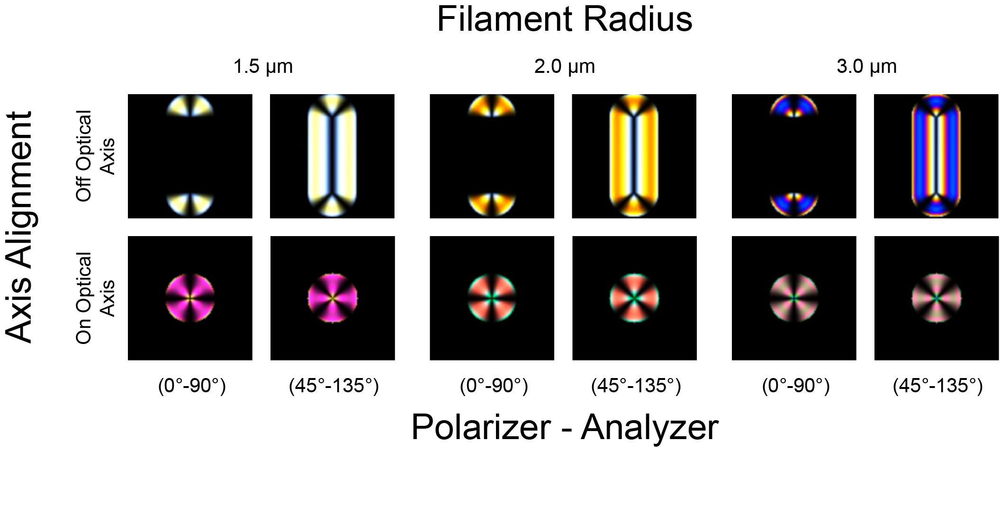
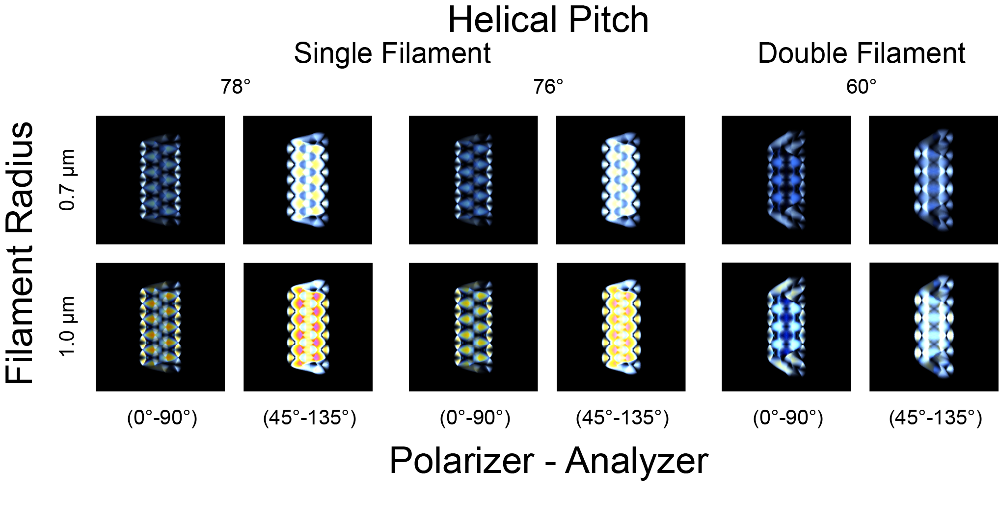

# Smectic Filaments, Ribbons, and Helices.
This repository provides Python code and Jupyter notebooks to simulate optical textures of filamentous smectic materials—specifically ribbons and helices—by generating director fields based on experimental geometry. Local tangent planes define director slices, which are mapped globally and passed to LCPOM to simulate light propagation and reconstruct textures for comparison with experiments.


<p align="center">
  
  
</p>


## Features

- **Director Field Generation**: Algorithms to construct 3D director fields for:
  - Single Helical Filament Generation
  - Double Helical Filament Generation
  - Smectic Ribbon Generation
  - Smectic Filament Generation
- **Tangent Plane Slicing**: Analytical computation of tangent vectors along filament centerlines and construction of local orthonormal frames
- **Texture Simulation**: Integration with LCPOM to propagate polarized light through the smectic structure and compute transmitted intensity fields
- **Visualization**: Tools for rendering modeled director fields

## Repository Structure

```
├── Smectic_Single_Filament_Helix_Coalesced.ipynb
├── Smectic_Double_Filament_Helix_Coalesced.ipynb
├── Smectic_Filaments.ipynb
├── Smectic_Ribbon.ipynb
└── lcpom_usage.ipynb
```

## Prerequisites

- Python 3.8 or higher
- NumPy, SciPy
- Matplotlib
- LCPOM found here: https://github.com/depablogroup/lc-pom

## Usage

1. **Clone the repository**:
   ```bash
   git clone https://github.com/yzagzag/Smectic_Helices.git
   cd Smectic_Helices
   ```

2. **Open a Jupyter notebook**:
   ```bash
   jupyter lab
   ```

3. **Run the notebooks**
   - Generate director fields for filament ribbon and helix geometries
   - Call LCPOM to compute optical textures
   - Compare simulated textures with microscopy images

Each notebook contains detailed parameter descriptions and example figures.

## Customization

- Modify geometric parameters in each notebook (e.g., filament radius, pitch...)
- Adjust grid resolution and numerical interpolation settings
- Experiment with different polarizer/analyzer angles in LCPOM


## Contact

Yvonne Zagzag (Y.Z.) – yzagzag.at.sas.upenn.edu

