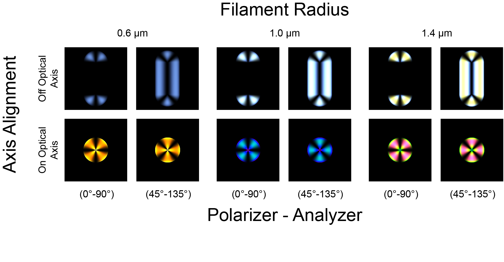
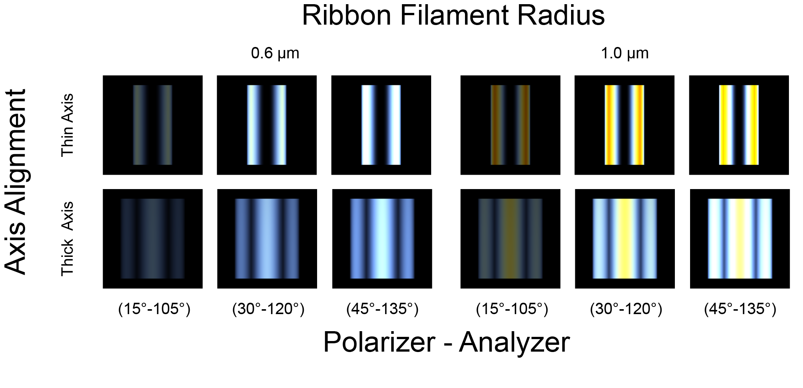

# Smectic Filaments, Ribbons, and Helices

This repository contains numerical and visualization code associated with the paper “Arrested coalescence drives helical coiling and networking of filamentous smectic condensates.”

Preprint: arXiv:2603.12124

The repository includes MATLAB calculations for the energetic and geometric models presented in the paper, together with Python/Jupyter notebooks for constructing smectic director fields and simulating polarized optical microscopy textures.

  
  

## Repository Structure

    Smectic-Helices/
    │
    ├── README.md
    ├── ArrestedCoalescenceNumerics.m
    │
    ├── Smectic_Filaments.ipynb
    ├── Smectic_Ribbons.ipynb
    ├── Smectic-Double-Coil-Generation.ipynb
    │
    ├── Smectic-Filaments.png
    ├── Smectic-Ribbons.png
    │
    ├── Graphics/
    │   ├── Graphics_3D.ipynb
    │   ├── director_raw.npz
    │   ├── Interpolated_director_Lx400_Ly400_Lz400.npz
    │   └── helix.png
    │
    ├── lc-pom/
    │   ├── LCPOM_Usage.ipynb
    │   └── params.py
    │
    └── old_versions/

## Code

**ArrestedCoalescenceNumerics.m**  
MATLAB calculations used for the theoretical modeling in the manuscript, including ribbon energetics and geometry and the comparison between ribbon and coil energies.

**Smectic_Filaments.ipynb**  
Generates director fields for individual smectic filaments.

**Smectic_Ribbons.ipynb**  
Generates director fields for conjoined filamentous ribbons.

**Smectic-Double-Coil-Generation.ipynb**  
Generates the three-dimensional geometry and director field of double-helical smectic filaments.

**Graphics/Graphics_3D.ipynb**  
Provides interpolation and visualization tools for the generated three-dimensional director fields.

**lc-pom/LCPOM_Usage.ipynb**  
Passes generated director fields to LCPOM to calculate simulated polarized optical microscopy textures.

## Director-Field Workflow

Director fields are constructed from local cross-sectional configurations along prescribed filament centerlines and mapped into a global three-dimensional coordinate system.

The generated fields can be saved as scattered data (`director_raw.npz`) or interpolated onto a regular three-dimensional grid (`Interpolated_director_Lx400_Ly400_Lz400.npz`). The interpolated fields can then be passed to LCPOM for optical simulation.

## Requirements

### Python

- Python 3.8+
- NumPy
- SciPy
- Matplotlib
- Jupyter Notebook or JupyterLab
- LCPOM: https://github.com/depablogroup/lc-pom

Install the Python dependencies with:

    pip install numpy scipy matplotlib jupyter

### MATLAB

`ArrestedCoalescenceNumerics.m` requires MATLAB.

## Usage

Clone the repository:

    git clone https://github.com/yzagzag/Smectic_Helices.git
    cd Smectic_Helices

Start JupyterLab:

    jupyter lab

For the director-field workflow:

1. Generate a filament, ribbon, or double-coil director field using the corresponding notebook.
2. Use `Graphics/Graphics_3D.ipynb` to interpolate and visualize the field.
3. Use `lc-pom/LCPOM_Usage.ipynb` to simulate polarized optical microscopy textures.

The MATLAB calculations can be reproduced by running:

    ArrestedCoalescenceNumerics.m

## LCPOM

Optical simulations use the LCPOM package developed by the de Pablo group:

https://github.com/depablogroup/lc-pom

The relevant LCPOM workflow and parameters used for this work are included in the `lc-pom` directory.

## Contact

Yvonne Zagzag  
University of Luxembourg  
yvonne.zagzag@uni.lu
